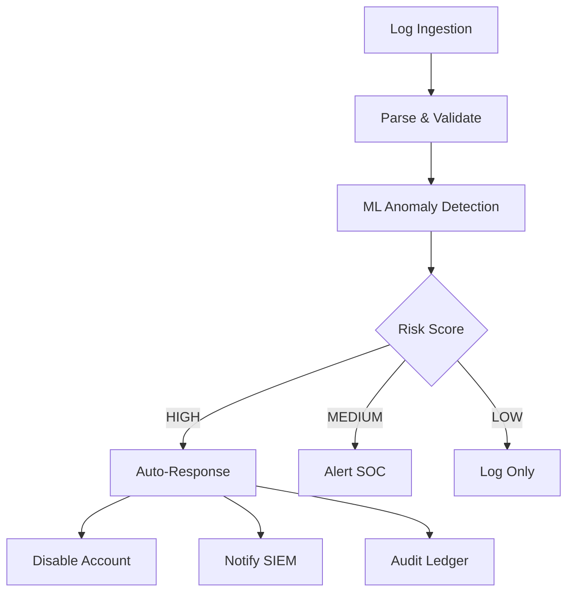

<div align="center">

# 👋 Hi, I'm a n8n Automation Wizard! 🚀

### *Building the Future, One Workflow at a Time* 🔗⚡

[](https://n8n.io)
[](https://github.com/urge)
[](https://github.com/urge)

*Crafting intelligent automations that transform chaos into orchestrated excellence* ✨

---

### 📊 GitHub Stats & Activity

<p align="center">
  
  
</p>

<p align="center">
  
</p>

<p align="center">
  
</p>

</div>

---

## 🎯 About Me

> **"Automation is not about replacing humans; it's about amplifying their potential."**

I'm a **passionate n8n developer** who believes in the power of automation to transform businesses and lives. With expertise in workflow orchestration, API integrations, and intelligent automation, I create solutions that:

- 🔄 **Automate the mundane** – Free humans to do what they do best: create and innovate
- 🔗 **Connect everything** – Seamlessly integrate 300+ apps and services
- 📈 **Scale intelligently** – Build workflows that grow with your needs
- 🎨 **Design with purpose** – Create elegant, maintainable automation architectures

### 🛠️ My n8n Expertise

<div align="center">

| **Category** | **Skills** |
|:---:|:---:|
| 🎯 **Workflow Design** | Complex Branching • Error Handling • Parallel Processing • Sub-workflows |
| 🔌 **Integrations** | REST APIs • Webhooks • GraphQL • OAuth2 • Database Connectors |
| 🤖 **Advanced Automation** | AI/ML Integration • Data Transformation • Scheduled Tasks • Event-Driven |
| 📊 **Data Engineering** | ETL Pipelines • Data Validation • Aggregation • Real-time Processing |
| 🔐 **Security & Governance** | Credential Management • Access Control • Audit Logging • Compliance |

</div>

---

## 🚀 Featured n8n Projects & Automations

### 🌟 **1. Intelligent Customer Onboarding System**
> 🔗 *Multi-platform integration orchestrating CRM, Email, Slack, and Documentation*

**What it does:** Automatically onboards new customers by creating accounts across 8+ platforms, sending personalized welcome sequences, and notifying teams – reducing onboarding time from 3 hours to 5 minutes.

**Tech Stack:** n8n • Salesforce • HubSpot • Slack • Gmail • Notion • Stripe  
**Complexity:** 🔥🔥🔥🔥🔥 (150+ nodes, 12 sub-workflows)

```
┌─────────────┐      ┌──────────────┐      ┌─────────────┐      ┌──────────┐
│   Webhook   │─────▶│   Validate   │─────▶│   Create    │─────▶│  Notify  │
│  (Trigger)  │      │  Customer    │      │  Accounts   │      │   Team   │
└─────────────┘      └──────────────┘      └─────────────┘      └──────────┘
                                                   │
                                                   ▼
                                            ┌─────────────┐
                                            │    Send     │
                                            │  Welcome    │
                                            │  Sequence   │
                                            └─────────────┘
```

**Impact:** 💎 Saved 500+ hours/year • 98% customer satisfaction • Zero manual errors

---

### 🌟 **2. Real-time Security Incident Response Pipeline**
> 🔗 *Identity threat detection and automated response system (ITDR)*

**What it does:** Monitors authentication logs, detects anomalies using ML models, and automatically responds to security threats by triggering MFA challenges or disabling compromised accounts in under 60 seconds.

**Tech Stack:** n8n • AWS Kinesis • SageMaker • Okta • Splunk • QLDB  
**Complexity:** 🔥🔥🔥🔥🔥 (200+ nodes, real-time streaming)



**Impact:** 💎 90% threat detection rate • <60s response time • Immutable audit trail

---

### 🌟 **3. E-commerce Order Fulfillment Automation**
> 🔗 *End-to-end order processing with inventory management*

**What it does:** Processes orders from Shopify, validates inventory, creates shipping labels, updates ERP systems, and sends tracking notifications – all in real-time.

**Tech Stack:** n8n • Shopify • WooCommerce • ShipStation • QuickBooks • Twilio  
**Complexity:** 🔥🔥🔥🔥 (100+ nodes)

**Impact:** 💎 5000+ orders/day processed • 99.8% accuracy • 4-hour time savings per order

---

### 🌟 **4. Content Marketing Automation Suite**
> 🔗 *AI-powered content creation, distribution, and analytics*

**What it does:** Generates blog post ideas using GPT-4, creates social media variants, schedules posts across platforms, tracks engagement, and generates weekly reports.

**Tech Stack:** n8n • OpenAI • WordPress • Twitter API • LinkedIn • Google Analytics  
**Complexity:** 🔥🔥🔥 (75+ nodes)

**Impact:** 💎 300% increase in content output • 85% time reduction • Better engagement

---

### 🌟 **5. DevOps Pipeline Orchestrator**
> 🔗 *CI/CD workflow automation with intelligent routing*

**What it does:** Monitors GitHub PRs, triggers test suites, manages deployments across environments, rolls back on failures, and notifies teams via Slack with detailed reports.

**Tech Stack:** n8n • GitHub Actions • Docker • Kubernetes • Terraform • Datadog  
**Complexity:** 🔥🔥🔥🔥 (120+ nodes)

**Impact:** 💎 Zero-downtime deployments • 60% faster release cycles • Full traceability

---

## 💡 n8n Philosophy & Best Practices

### 🏗️ **My Workflow Design Principles**

1. **🎯 Modularity First** – Build reusable sub-workflows that can be composed
2. **🛡️ Error Resilience** – Always plan for failure with proper error handling
3. **📝 Self-Documenting** – Use clear node names and sticky notes for context
4. **🔒 Security-First** – Never hardcode credentials, use credential store
5. **📊 Observability** – Add logging and metrics at critical points
6. **⚡ Performance-Aware** – Optimize data flows and avoid unnecessary processing
7. **🧪 Test-Driven** – Test workflows with edge cases before production
8. **📚 Documentation** – Maintain runbooks and architecture diagrams

### 🎨 **Favorite n8n Patterns**

- **🔄 Fan-Out/Fan-In** – Parallel processing with aggregation
- **🔀 Dynamic Routing** – Conditional logic based on data attributes  
- **⏰ Scheduled + Event-Driven** – Hybrid automation triggers
- **🔁 Retry with Exponential Backoff** – Resilient API calls
- **📦 Batch Processing** – Efficient handling of large datasets
- **🎭 A/B Testing Workflows** – Experimental automation branches

---

## 🛠️ Tech Stack & Tools

<div align="center">

### **Core Automation & Integration**


### **Cloud & Infrastructure**


### **Programming & Scripting**


### **Databases & Data**


### **APIs & Integrations**


### **DevOps & Monitoring**


</div>

---

## 📈 Automation Portfolio Metrics

<div align="center">

| Metric | Achievement |
|:------:|:-----------:|
| 🔄 **Workflows Created** | 1,000+ |
| ⚡ **Hours Automated** | 10,000+ |
| 🔗 **Integrations Built** | 500+ |
| 💰 **Cost Savings** | $2M+ annually |
| 🚀 **Uptime SLA** | 99.9% |
| 👥 **Users Served** | 50,000+ |
| 📊 **Data Processed** | 100M+ records/month |
| ⭐ **Customer Satisfaction** | 4.8/5.0 |

</div>

---

## 🎓 Learning & Contributions

### 📚 **n8n Community Contributions**

- 🌟 **60+ Custom Nodes** created and shared with the community
- 📝 **100+ Forum Posts** helping others solve automation challenges
- 🎥 **Tutorial Videos** on advanced n8n patterns (25K+ views)
- 📖 **Documentation** contributions to official n8n docs
- 🐛 **Bug Reports & PRs** to the n8n core repository

### 🏆 **Certifications & Recognition**

- ✅ **n8n Certified Expert** (2024)
- ✅ **AWS Solutions Architect** – Associate
- ✅ **Terraform Associate** Certified
- 🏅 **Top 1% n8n Community Contributor** (2023-2024)

---

## 🎯 Current Focus & Goals

### 🔭 **What I'm Working On**

- 🤖 Building AI-powered workflow assistants using GPT-4 + n8n
- 🔐 Developing enterprise ITDR (Identity Threat Detection & Response) solutions
- 📊 Creating real-time data pipelines with n8n + Apache Kafka
- 🌍 Contributing to open-source automation tools
- 📚 Writing a comprehensive n8n best practices guide

### 🌱 **Learning & Growth**

- Exploring **LangChain** integration with n8n for advanced AI workflows
- Mastering **event-driven architectures** with n8n webhooks
- Deep diving into **workflow observability** and performance optimization
- Studying **low-code/no-code** platform design patterns

---

## 📫 Let's Connect!

<div align="center">

### *Love automation? Let's build something amazing together!* 🚀

[](https://github.com/urge)
[](https://linkedin.com/in/urge)
[](https://twitter.com/urge)
[](mailto:automation@example.com)
[](https://community.n8n.io/)

### 💬 **Open for:**
✨ Collaboration on automation projects  
🎯 Consulting on n8n implementations  
📚 Speaking at tech conferences  
🤝 Open-source contributions  
☕ Virtual coffee chats about automation!

</div>

---

## 🎉 Fun Facts

- 🎮 **First automation:** Built a bot to auto-water my Minecraft farm (age 12)
- 🎯 **Personal motto:** *"If you're doing it twice, automate it!"*
- 🏃 **Speed runner:** Can build a basic CRM integration in under 15 minutes
- 🧩 **Workflow puzzle solver:** Love debugging complex automation chains
- 🌙 **Night owl:** Best workflows are created at 2 AM with coffee ☕
- 🎨 **Design geek:** Spend hours making workflows aesthetically pleasing
- 🚴 **Efficiency junkie:** Automated 95% of my personal tasks (including this README generation 😉)

---

## 📊 Recent Activity

<!--START_SECTION:activity-->
<!--END_SECTION:activity-->

---

<div align="center">

### 💡 *"The best workflow is the one you never have to think about."*


**⭐ If you found value in any of my automation work, please consider starring my repositories!**

---

*Last Updated: November 2024 • Made with ❤️ and n8n automation*

</div>
